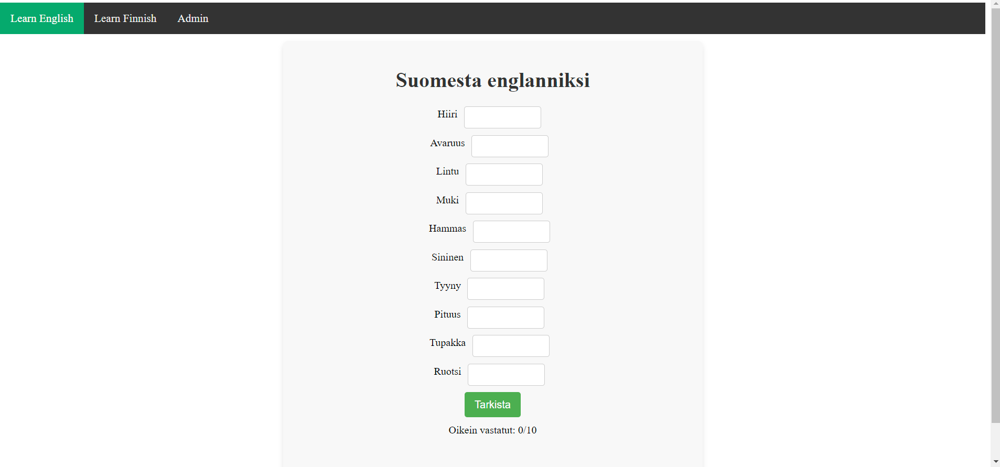
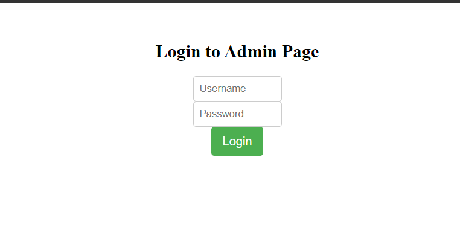

# Learn English Web application with Node.js and React

Learn Language project work is web page made with React and
backend made with node.js and database with MySQL. Learn
Language webpage is made to teach english and finnish
to kids. There is always 10 randomized words to play and webpage will give correct answer if user give wrong answer. Then webpage tell how many words user got correct.

Then there is Admin page behind username and password where Admin can add new words, delete words and update words.

You can try admin page to login with this
Username: admin
Password: password

# Author

Juho Viskari

# Screenshots

# Tech/framework used

Languages used: Node.js, React.jsx

Modules used:

- javax.swing.JOptionPane which is main part of GUI input
- java.io.BufferedReader read text from file line by line when load client
- java.io.FileReader take file name and open file to reading when load client
- java.io.FileWriter take file name and write to file when saving client
- java.io.IOException makes IOException if loading or saving there is problem
- java.io.PrintWriter write formated text to clients.txt
- java.util.ArrayList stores dynamic array for adding, removing and access
  elements

# Installation and running

#clone repo

git clone https://github.com/JuhoViskari/project-work-juho-viskari

#runs

cd project-work-juho-viskari/src/ && javac \*ContactsApp.java && java ContactsApp

# Screencast

