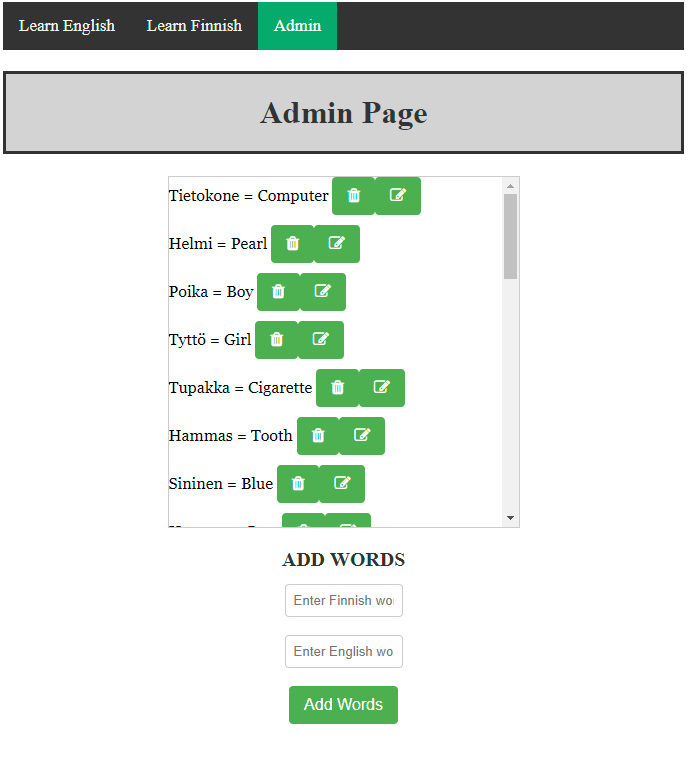

# Learn English Web application with Node.js and React

Learn Language project work is web page made with React and
backend made with node.js and database with MySQL. Learn
Language webpage is made to teach english and finnish
to kids. There is always 10 randomized words to play and webpage will give correct answer if user give wrong answer. Then webpage tell how many words user got correct.

Then there is Admin page behind username and password where Admin can add new words, delete words and update words.

# Motivation

Motivation behind the creation was that this was pretty interesting school
project work and motivation came by backend development teacher to make
learn english web application

# Screenshots

# Tech/framework used

Languages used: Node.js, React.jsx

Frontend dependencies:

- react to using react components
- react-dom using react components
- react-router-dom using routes with react components

Backend dependencies:

- cors frontend and backend work together different server
- dotenv to env file
- express making routes to backend
- mysql backend can communicate with mySql database

Global dependencie:

- concurrently npm start open frontend and backend same time

# Installation

You can install and start locally this app with under order

1. git clone https://github.com/JuhoViskari/learn-english-project-app

2. cd learn-english-project-app

3. npm install (check you are root directory: learn-english-project-app)

4. cd backend

5. add your .env file /backend directory
   You can add your own SECRET_KEYS to MySQL connection or
   you can use

   This project mysql connection .env file SECRET_KEYS:
   password: MY_SECRET_KEY=
   user: MY_SECRET_KEY_2=
   database: MY_SECRET_KEY_3=
   host: MY_SECRET_KEY_4=

6. change your own personal .env SECRET_KEYS with backend/config if you dont use this project SECRET_KEYS.js

7. Make your MySQL table:

CREATE TABLE IF NOT EXISTS learn(
id INT AUTO_INCREMENT PRIMARY KEY,
english VARCHAR(255) DEFAULT NULL,
finnish VARCHAR(255) DEFAULT NULL
);

8. go to root directory (learn-english-project-app)
   and give command npm start
   after that it will open backend and frontend same time locally.
   you can test backend connection easiest way with test.http file which locate in backend directory

   if you want try react frontend localhost:5174 link with backend you need change all frontend fetch urls to:
   "http://localhost:8080/api/learn"

# API Reference

https://learnenglish-2st0.onrender.com/

You can try login page with these:

Username: admin

Password: password

# Screencast

# Author

Juho Viskari
